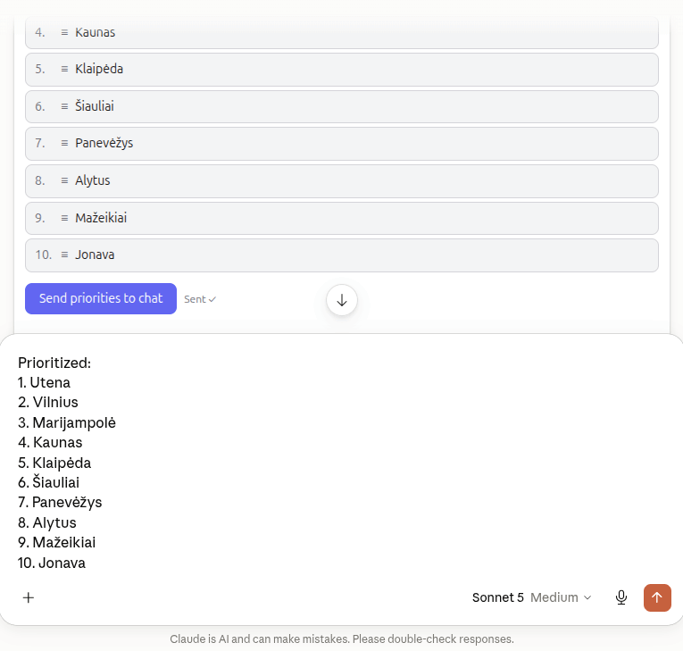

# Claude (Code, Desktop, Cowork)

## MCP Apps support at a glance

| Surface | Tool works | Renders drag-and-drop UI |
| --- | --- | --- |
| Claude Cowork | ✅ | ✅ |
| Claude Desktop | ✅ | ✅ |
| Claude Code (CLI) | ✅ | ❌ (as of 2.1.220) |
| Claude Code (VS Code extension) | ✅ | ❌ (as of 2.1.220) |

Where the UI is not rendered, the tool returns only the fallback text
`Use MCP apps integration to rearrange elements`. For the interactive view
inside VS Code, use the *native* chat instead — see
[VS Code](/docs/vscode.md).

## Claude connectors (HTTP-hosted server)

The deployed server[^live-server] at
`https://mcp-prioritization.netlify.app/mcp` (see
[Netlify](/docs/netlify.md)) can be added straight from the Claude UI:

1. **Customize → Connectors → Add → Add custom connector**
2. Under **Remote MCP server URL** enter:
   `https://mcp-prioritization.netlify.app/mcp`



Example queries to force the MCP tool to be picked up:

```
List top 10 biggest cities in Lithuania
Let me prioritize cities to visit
```

> **Model requirement:** at least a **Sonnet**-tier model — in testing,
> Haiku did not call the tool.

## Claude Code

```bash
claude mcp add prioritization -- npx tsx src/stdio.ts
```

Then check with `claude mcp list` or `/mcp` inside a session. For a
project-scoped, shareable registration use
`claude mcp add --scope project ...` (writes `.mcp.json`).

Debugging:

```bash
claude mcp list                    # is the server registered + connected?
claude mcp get prioritization      # exact command/args being run
claude --debug                     # run a session with MCP connection logs
```

## Claude Desktop (Linux)

Edit (or create) the config file:

```
~/.config/Claude/claude_desktop_config.json
```

Add the server under `mcpServers`:

```json
{
  "mcpServers": {
    "prioritization": {
      "command": "npx",
      "args": [
        "tsx",
        "/path/to/mcp-apps-test-netlify/src/stdio.ts"
      ]
    }
  }
}
```

Restart Claude Desktop completely (quit from the tray, not just close the
window). Calling `human_prioritization` renders the drag-and-drop list
inline.

> **stdio rule:** the stdio entry point must never write to stdout except
> JSON-RPC — stdout carries the protocol framing. All logs go to stderr
> (`console.error`).

[^live-server]: Deployed MCP server (Netlify)
